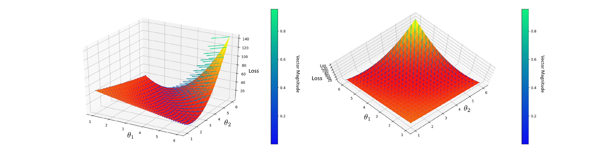

# Masters
Code from my Masters work on geometric regularizers for artificial neural networks

Smaller dataset networks were implemented directly in Jax, while the CIFAR-10 network was implemented with Stax

